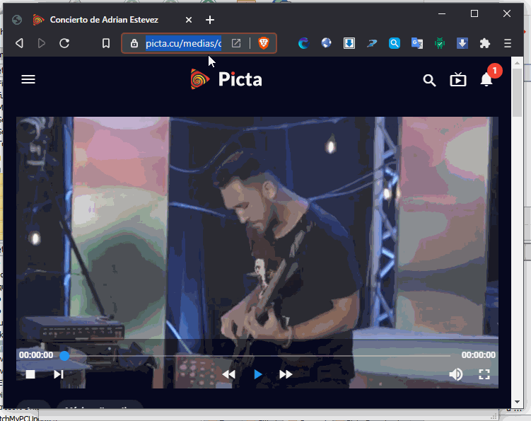
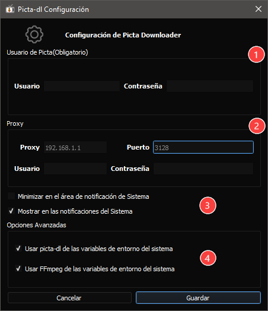

# picta-dl-gui
__Picta Downloader GUI__ es una aplicación que le permite descargar contenidos audiovisuales desde [Picta](https://www.picta.cu), la misma es una __GUI__ (interfaz gráfica de usuario) o del inglés
(graphical user interface) de la app de descargar por consola [picta-dl](https://github.com/oleksis/youtube-dl).

# Captura de pantalla


# Configuración
La configuración actual de __Picta Downloader GUI__ es muy sencilla, consta de 3 partes de las cuales una es opcional para el caso que necesite configurar conexión a través de Proxy.

## Las opciones son las siguientes:

1. Debe poner su usuario y contraseña de [Picta](https://www.picta.cu) . Es una configuración obligatoria ya que sin esto la aplicación no puede obtener las listas de contenidos o listas de  reproducción (vídeo y audio) que brindan las URL y por tanto tampoco podrá descargar.

2. Si su conexión es a través de un Proxy puede agregar la IP y puerto de este para que pueda conectarse; si requiere autenticación Básica puede agragar usuario y contraseña del proxy.

3. Puede seleccionar si quiere ver los mensajes de la aplicación como notificaciones del Sistema y si quiere que esta no se minimize en la barra de tareas.

4. Opciones Avanzadas: En este apartado debe tener mucho cuidado y saber lo que esta haciendo pues una mala configuración puede hacer que no le funcione la GUI. Aquí ud. seleccionar si quiere usar picta-dl o FFmpeg que tenga configurado en las variables de entorno del sistema, si tiene dudas sobre de que trata esto puede pasar el mouse (ratón) sobre el texto de la opción y verá la explicación de la misma.

Imagen de muestra con las opciones:



# Preguntas y respuestas frecuentes (F.A.Q)
[FAQ](docs/faq.md)

# Instrucciones para Desarrolladores
Muchos usuarios no necesitan compilar __Picta Downloader GUI__, la última versión puede ser descargada desde [latest releases](https://github.com/oleksis/picta-dl-gui/releases/latest)

Puedes colaborar en el desarrollo de __Picta Downloader GUI__ siguiendo los siguientes pasos:

1. Haz una [Bifurcación (Fork)](https://github.com/oleksis/picta-dl-gui/fork) a este repositorio:

2. Haz un Checkout al código fuente:
```bash		
    mkdir -p Picta-dl_GUI
    cd Picta-dl_GUI
    git clone git@github.com:TU_GITHUB_USERNAME/picta-dl-gui.git
```
3. Comienza una nueva rama (branch):
```bash	
    cd picta-dl-gui
    git checkout -b newfeatures
```
4. Cuando finalices de implementar las nuevas y asombrosas funcionalidades, [add](https://git-scm.com/docs/git-add) los nuevos ficheros, [commit](https://git-scm.com/docs/git-commit) y [push](https://git-scm.com/docs/git-push) el resultado final:
```bash	
    git add -A
    git commit -m '[newfeaures] Adicionar nueva funcionalidades'
    git push origin newfeatures
```
5. Finalmente, [crea un pull request](https://help.github.com/articles/creating-a-pull-request). Nosotros lo revisaremos y lo uniremos a la rama principal si es aceptado.

En cualquier caso __Muchas Gracias__ por su interés y contribuciones!

# Contribuciones
Lista de personas que han contribuido al desarrollo de __Picta Downloader GUI__ en [CONTRIBUTORS](CONTRIBUTORS.md)

## Errores y sugerencias

Errores y sugerencias deben ser reportados en [ GitHub Issues](https://github.com/oleksis/picta-dl-gui/issues)

## Telegram 
* Chat: __Picta Downloader Chat__ [@picta_dl_chat](https://t.me/picta_dl_chat)
* Grupo: __Picta Downloader__ [@picta_dl](https://t.me/picta_dl)

# License
[MIT](LICENSE)
